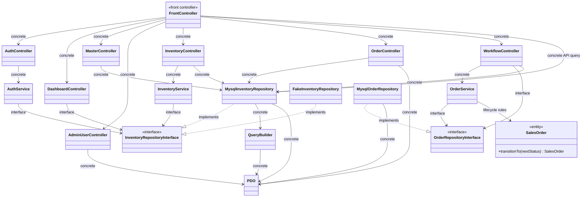

# Class Diagram As-Built

Diagram ini menggambarkan dependency yang terlihat pada implementasi saat ini. Label `interface` menandai dependency ke kontrak; label `concrete` menandai dependency ke class implementasi.

Rancangan awal membayangkan akses data controller melewati service dan interface repository. Implementasi as-built memakai interface untuk service auth, dashboard, inventori, dan order, tetapi beberapa controller serta endpoint API masih bergantung pada repository MySQL atau PDO secara langsung. Perubahan lifecycle Sales Order juga dipusatkan pada entity `SalesOrder`; dependency konkret yang tersisa dicatat di `docs/quality/tech-debt.md`.
