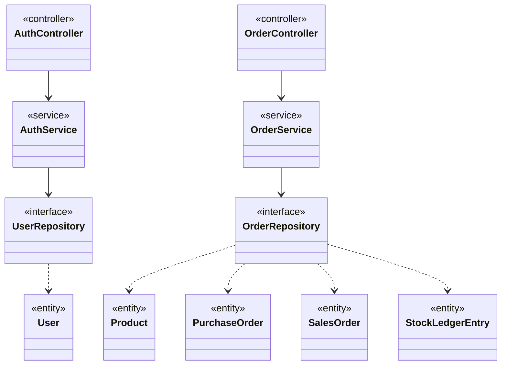

# Rekonstruksi Class Diagram Awal

Diagram ini merekonstruksi rancangan awal: domain records direncanakan sebagai objek sederhana, dan HTTP direncanakan bergantung pada service serta abstraksi repository.

**Batas bukti:** diagram ini ditulis setelah implementasi dan bukan artefak bertanggal sebelum coding. Diagram ini dapat dipakai untuk membandingkan rancangan dengan as-built, tetapi tidak membuktikan bahwa initial class diagram dibuat sebelum coding seperti diminta DESIGN-01 pada brief.
