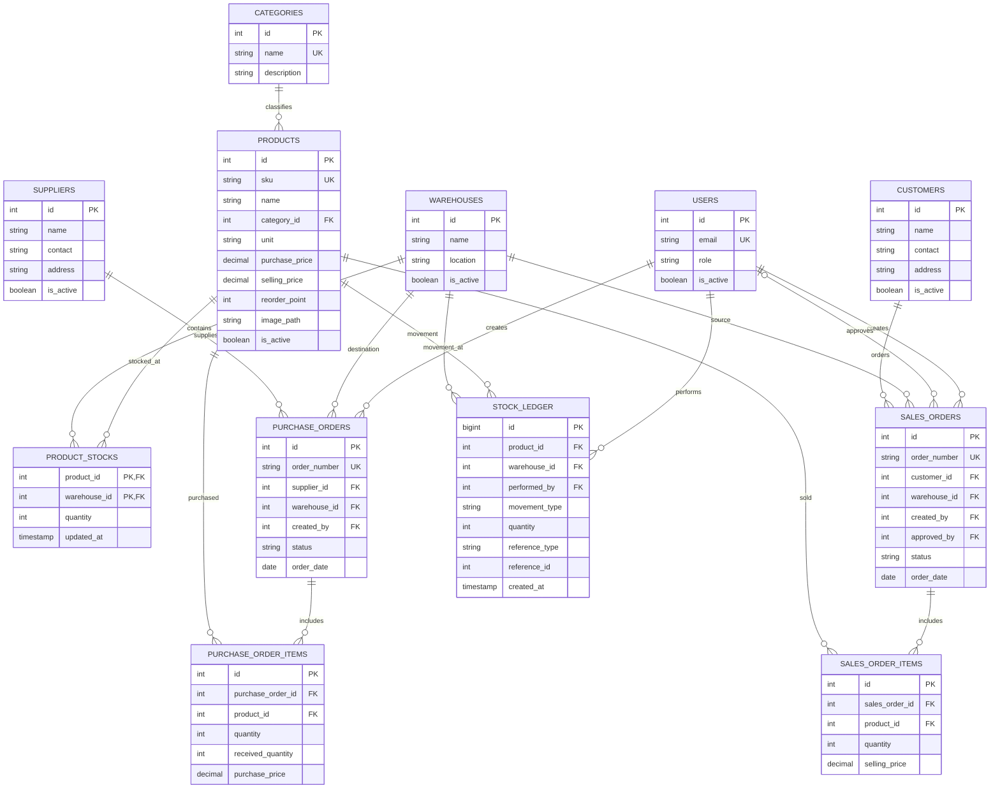

# ERD Database (As-Built)

ERD berikut merangkum tabel, key utama, dan relasi pada schema yang dipasang melalui `database/schema-and-seed.sql` beserta migration.

`PRODUCT_STOCKS` memakai composite primary key `(product_id, warehouse_id)`. `STOCK_LEDGER.reference_type` dan `reference_id` adalah pasangan referensi polimorfik untuk PO, SO, atau penyesuaian; keduanya tidak membentuk foreign key langsung ke satu tabel transaksi. Tipe kolom lengkap, enum, index, dan check constraint tetap mengikuti schema SQL.

Contoh index: `idx_sales_orders_status_date (status, order_date)` mendukung filter status dan pengurutan tanggal pada daftar/dashboard order. Contoh transaksi multi-tabel dijelaskan di `docs/architecture/adr-002-stock-locking.md`: pembaruan ProductStock, penulisan StockLedger, dan perubahan status SO di-commit atau di-rollback bersama.
